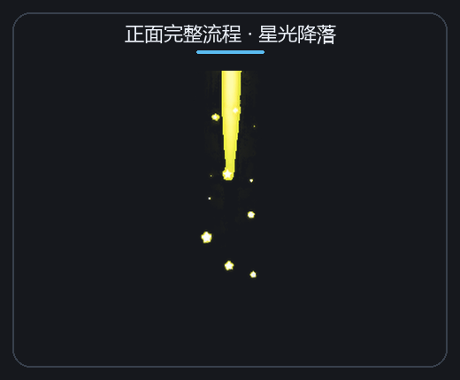
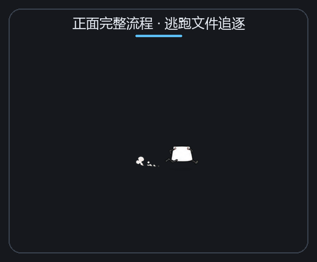
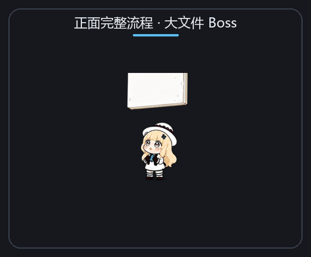
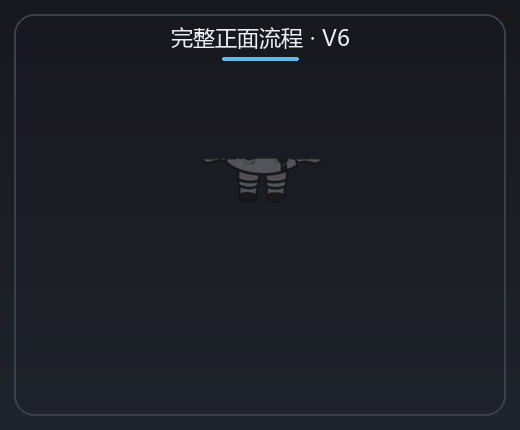

# Phoebe Cleaner / 菲比文件清理器

Phoebe Cleaner 是一个 Windows 11 桌面宠物式文件清理工具。在资源管理器中右键文件或文件夹，选择“召唤菲比来清理”，菲比会出现在目标旁边，通过一段完整动画把目标送进回收站。

当前动画版本：**V10**。V6 的随机动作与彩蛋保持不变，V8～V10 共提供 10 条不参与动作拼接的完整正面流程。

## 动画预览

下面的 GIF 直接使用程序实际加载的正式图集生成，不是概念效果图。

### 实际运行演示

[▶ 点击观看 2026-08-08 实际运行演示（MP4，5.9 MiB）](https://raw.githubusercontent.com/thjyy/phoebe-cleaner-feibi/main/docs/demos/phoebe-cleaner-demo-2026-08-08.mp4)

### V8 固定正面流程：法阵点心

<p align="center">
  
</p>

这条流程从入场、拿文件、进食、满足到退场使用同一套人物比例和连续姿势，共 3 段、87 帧，标准档约 5 秒。段落边界复用完全相同的交接帧，不再随机拼接满足或退场动作。

### V9 新增三套完整正面流程

<p align="center">
  
  
  
</p>

- **睡云召唤**：从云中睡醒、文件飘到手中、困倦地吃完，再睡进云里飘走。
- **传送门探头**：从正面传送门探头跳出、把文件卷成纸卷吸入，挥手退回传送门。
- **星光降落**：沿星光落地并接住文件、变成星星饼干吃掉，最后从脚向上化成星光。

### V10 六种不同动作机制

<p align="center">
  
  
  
</p>
<p align="center">
  
  
  
</p>

- **贪吃帽子**：菲比从活帽子里钻出；帽子抢先吞掉文件，挨训后又把菲比接回去跳走。
- **文件果汁车**：推着搅拌车出现，把文件摇成果汁，坐下喝完后踩着小车离开。
- **逃跑文件追逐**：长腿文件逃跑，菲比用网和罩子捕获，吃完后把罩子当雪橇滑走。
- **魔法下午茶**：乘巨型茶杯降落，把文件变成茶点，喝完再坐旋转茶杯飞走。
- **空中特技投食**：用帽子当降落伞，踢起并杂耍文件碎片，鞠躬后由舞台幕布谢幕。
- **大文件 Boss**：和巨型文件角力，用大餐叉切成饼干吃完，撑着肚子拖叉慢慢离开。

V10 不是给同一个模板更换粒子效果：六套分别使用帽子、载具、追逐捕捉、茶具、舞台和巨型餐具机制，每套从入场到退场都固定成一支连续动画。

### 完整正面流程

<p align="center">
  
</p>

### 彩蛋动作

<p align="center">
  
</p>

## 当前功能

- 原生 Windows 资源管理器右键菜单，支持文件、文件夹和多选。
- 单次支持 1～20 个选中项目。
- 根据资源管理器真实选中项矩形定位，不使用鼠标位置猜测目标。
- 文件移动到回收站，不执行永久删除。
- 60 FPS 透明置顶动画窗口，窗口点击穿透，不影响资源管理器操作。
- 正面与侧身使用两条完全独立的动画管线，不播放会导致人物畸变的正侧面翻转。
- 普通单文件有 60% 概率使用完整正面流程池，其中 V10 占整体 50%、V8/V9 占整体 10%；同一套不会连续两次抽中。
- 单个文件达到 256 MiB 后固定使用“大文件 Boss”，处理段会随文件体积继续延长。
- 动作采用加权随机，并尽量避免连续两次抽到同一动作。
- 支持“简洁、标准、戏剧化”三档播放速度。
- 文件被占用或删除失败时播放专属失败动画，并保留原文件。
- 后台动画服务空闲 10 分钟后自动退出。

## 完整动画流程

```text
召唤
→ 256 MiB 以上的单文件直接播放“大文件 Boss”
→ 其他普通单文件有 50% 概率播放 V10 完整故事
→ 10% 概率播放 V8/V9 完整故事
→ 40% 概率进入 V6 随机拼接流程
→ 每第 5 次召唤插入“怎么又是我”彩蛋
→ 取起文件
→ 普通进食或文件类型专属彩蛋
→ 随机选择满足动画
→ 随机选择退场动画
```

普通单文件的完整正面流程总概率为 60%。连续两次不会抽中同一套，因此表中是排除上一套之前的基础概率。

| 完整流程 | 整体基础概率 | 版本 |
| --- | ---: | --- |
| 贪吃帽子 | 10% | V10 |
| 文件果汁车 | 9% | V10 |
| 逃跑文件追逐 | 9% | V10 |
| 空中特技投食 | 8.5% | V10 |
| 魔法下午茶 | 7.5% | V10 |
| 大文件 Boss | 6% | V10 |
| 法阵点心 | 3% | V8 |
| 睡云召唤 | 2.5% | V9 |
| 传送门探头 | 2.5% | V9 |
| 星光降落 | 2% | V9 |

V10 六套合计占普通单文件的 50%，V8/V9 合计占 10%，其余 40% 使用 V6 随机拼接流程。单个大文件不参与随机，达到 256 MiB 后 100% 使用“大文件 Boss”；空文件夹、多选文件以及每第 5 次召唤仍按原有专属彩蛋执行。

光点召唤和从天而降从第一帧开始就是正面动作；小跑、睡眼惺忪、探头和瞬移失误全程保持侧身。同一次流程不会混用两套人物比例。

## 入场动作与基础概率

| 入场动作 | 方向 | 基础概率 | 表现 |
| --- | --- | ---: | --- |
| 小跑入场 | 侧身 | 35% | 从屏幕边缘跑向目标 |
| 光点召唤 | 正面 | 22% | 在文件旁由光点凝聚出现 |
| 从天而降 | 正面 | 18% | 落地并带有轻微回弹和粒子 |
| 睡眼惺忪 | 侧身 | 12% | 像临时被叫醒一样赶来 |
| 探头入场 | 侧身 | 8% | 先从屏幕边缘探头，再进入 |
| 瞬移失误 | 侧身 | 5% | 出现在偏移位置，再赶到文件旁 |

入场方向会根据目标位置选择，避免从不合理的方向穿过文件。若上一次已经使用某个随机动作，本次会先排除它，再按剩余权重重新归一化，所以实际单次概率可能与表中的基础概率略有不同。

## 取文件与进食动作

| 场景 | 正面动作 | 侧身动作 | 触发方式 |
| --- | --- | --- | --- |
| 普通文件 | 正面取物、逐口吃掉 | 侧身取物、咬文件 | 默认 |
| 空文件夹 | 打开检查、举过头顶倒置抖动、疑惑摊手 | 打开检查、倒置抖动、侧身确认 | 单选且文件夹为空 |
| 多选文件 | 文件叠成饼干，逐张吃掉，脸颊逐渐鼓起 | 侧身逐张吃掉文件堆 | 选择 2～20 个项目 |
| 大文件 | 播放 171 帧“大文件 Boss”：角力、切成饼干、吃撑后拖叉离开 | 旧侧身蓄力动作仅保留为兼容资源 | 单个文件达到 256 MiB |
| 删除失败 | 咬不动、捂牙、把文件放回去 | 侧身咬不动并放弃 | 文件被占用、权限不足或回收站操作失败 |

多选彩蛋优先于大文件彩蛋。删除动作在进食动画后段触发；如果系统删除失败，程序会跳过满足动作，播放失败反应后正常退场。

## 满足动作与概率

正面和侧身管线分别在自己的动作池中抽取，不会为了播放满足动作而转身。

### 正面满足动作

| 动作 | 基础概率 |
| --- | ---: |
| 满足地挥手 | 62.5% |
| 摸肚子 | 37.5% |

### 侧身满足动作

| 动作 | 基础概率 |
| --- | ---: |
| 开心满足 | 50% |
| 摸肚子 | 33.3% |
| 开心弹跳 | 16.7% |

## 退场动作与概率

### 正面退场

| 动作 | 基础概率 |
| --- | ---: |
| 摸肚子后淡出 | 45% |
| 化成光点消失 | 35% |
| 打饱嗝后瞬移 | 20% |

### 侧身退场

| 动作 | 基础概率 |
| --- | ---: |
| 满足后淡出 | 30% |
| 蹦蹦跳跳离开 | 25% |
| 化成光点消失 | 18% |
| 打饱嗝后瞬移 | 12% |
| 吃太饱慢慢离开 | 10% |
| 躺下滚出屏幕 | 5% |

侧身管线遇到多选文件时，会优先使用“吃太饱慢慢离开”，不再参与普通退场抽取。随机满足和退场动作同样会尽量避免与上一次重复，因此表格表示基础权重，而不是每次调用后的绝对概率。

## 彩蛋与触发概率

| 彩蛋 | 触发概率/条件 | 是否随机 |
| --- | --- | --- |
| 瞬移失误 | 入场基础概率 5% | 是 |
| 空文件夹检查 | 满足“单选空文件夹”时 100% | 否 |
| 多文件饼干 | 选择 2～20 项时 100% | 否 |
| 大文件 Boss | 单个文件达到 256 MiB 时 100% | 否；处理时长随体积增长 |
| “怎么又是我” | 每第 5 次召唤触发；长期频率 20% | 否，按次数触发 |
| 删除失败捂牙 | 系统删除操作抛出错误时 100% | 否，按结果触发 |

“怎么又是我”可以和空文件夹、多文件或大文件彩蛋同时出现；它会保持当前管线的正面或侧身方向。

## 速度设置

开始菜单中打开“菲比清理设置”即可选择：

| 档位 | 时间倍率 | 适用场景 |
| --- | ---: | --- |
| 简洁 | 0.78× | 更快完成，不省略动作 |
| 标准 | 1.00× | 默认节奏 |
| 戏剧化 | 1.28× | 更长停顿和表演时间 |

设置和随机历史保存在 `%LOCALAPPDATA%\PhoebeCleaner`。

### 按文件大小调整动画时长

入场和退场保持原本节奏，主要延长取文件、加工和进食段。V10 每段使用 57 帧，一整套共 171 帧；小文件的标准档完整流程约 6～8 秒，接近 256 MiB 时仍大致控制在 10 秒以内。超过 256 MiB 后取消时长上限，每当文件体积翻倍都会继续增加处理时间，因此特别大的文件可以自然成为例外，而不会把“大文件 Boss”强行快进。

速度档位会继续叠加在文件大小节奏之上：简洁档整体更快，戏剧化档整体更慢，但不会删减帧或跳过动作。

## 技术架构

- `PhoebeShellExtension.dll`：原生 C++20 `IExplorerCommand` Shell 扩展，读取准确的选中路径、来源视图和项目位置。
- `PySide6` 动画服务：负责透明窗口、精灵图、粒子、移动轨迹、随机状态机和异步回收站操作。
- `QLocalServer`：保持单实例后台进程，并按顺序接收连续清理任务。
- `send2trash`：调用系统回收站，而不是永久删除文件。
- `baked_animation_v6`：经过尺寸、透明度、锚点和边界校准的正式 15 帧动画图集。
- `baked_full_sequence_v8`：最新固定正面流程的 3 张 29 帧正式图集。
- `baked_front_sequences_v9`：睡云、传送门、星光三套完整流程，共 9 张 29 帧正式图集。
- `baked_motion_families_v10`：六种不同动作机制的完整流程，共 18 张 57 帧正式图集。

资源管理器详情视图不提供图标坐标时，Shell 扩展会把准确的视图窗口句柄交给 Qt，由 Qt 只在该视图中查找已选中行，避免定位到同名文件或错误窗口。

## 构建与安装

普通用户可直接从 [GitHub Releases](https://github.com/thjyy/phoebe-cleaner-feibi/releases/latest) 下载 `PhoebeCleaner-Setup-v0.4.1.exe`。安装器按当前用户安装，不要求管理员权限，并自动配置右键菜单、设置快捷方式和标准卸载入口。

以下步骤用于从源码构建：

环境要求：

- Windows 11
- Python 3.11+
- CMake
- Ninja
- 支持 C++20 的 MinGW-w64 GCC

构建并安装：

```powershell
powershell -ExecutionPolicy Bypass -File .\scripts\build_python.ps1
powershell -ExecutionPolicy Bypass -File .\scripts\install_python.ps1
```

生成单文件 Release 安装包：

```powershell
powershell -ExecutionPolicy Bypass -File .\scripts\build_release.ps1
```

构建结果写入 `dist-qt-builds/<时间戳>/PhoebeCleanerQt`，`build/latest-python-app.txt` 指向最新版本。使用时间戳目录可以避免资源管理器锁定已加载 DLL 时阻塞下一次构建。

安装后，在 Windows 11 资源管理器中右键目标；根据系统菜单设置，命令可能位于“显示更多选项”中。如果资源管理器仍缓存旧版 Shell 扩展，重启一次 Explorer 进程即可。

卸载：

```powershell
powershell -ExecutionPolicy Bypass -File .\scripts\uninstall.ps1
```

## 动画资源

- `assets/phoebe/baked_animation_v6`：程序实际加载的 V6 正式动画图集。
- `assets/phoebe/baked_full_sequence_v8`：程序实际加载的 V8 完整“法阵点心”流程图集。
- `assets/phoebe/generated_full_sequences_v8`：V8 三段连续动画的绿幕源图与透明化结果。
- `assets/phoebe/baked_front_sequences_v9`：程序实际加载的 V9 三套完整正面流程图集。
- `assets/phoebe/generated_front_full_sequences_v9`：V9 九张绿幕源图与透明化结果。
- `assets/phoebe/baked_motion_families_v10`：程序实际加载的 V10 六套完整正面流程图集。
- `assets/phoebe/generated_motion_families_v10`：V10 十八张绿幕源图与透明化结果。
- `assets/phoebe/generated_easter_eggs_v6`：V6 彩蛋的绿幕生成源图与透明化结果。
- `assets/phoebe/generated_front_pipeline_v5`：无畸变正面流程的生成源图。
- `tools/build_easter_eggs_v6.py`：V6 彩蛋图集统一尺寸和锚点的构建脚本。
- `tools/build_full_sequence_v8.py`：V8 图集裁切、去接缝、统一锚点、位移补间和预览 GIF 构建脚本。
- `tools/build_front_sequences_v9.py`：V9 三套完整正面流程的构建与 GIF 预览脚本。
- `tools/build_motion_families_v10.py`：V10 道具安全边界、段落交接帧、光流补间和六支 GIF 的构建脚本。
- `tools/smoke_v10_assets.py`：离屏加载全部完整流程，验证每段图集帧数和资源路径。
- `tools/normalize_sprite_anchors.py`：精灵人物锚点校准工具。

V4 的正侧面翻转图集不会被 V6 打包或加载。
